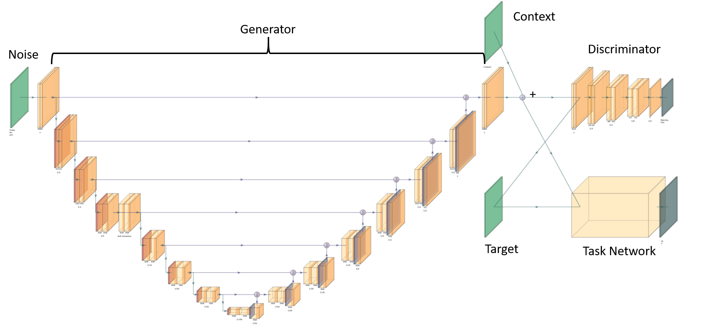

# SATGAN

# TODO: update the article URL once published.
# [Article about this implemention](https://affinelayer.com/pix2pix/)

The self-attentive task generative adversarial network (SATGAN) learns
to emulate realistic target sensor noise characteristics in order to
augment existing datasets with simulated scenes that better approximate
real-world systems. It learns a mapping from random input noise to realistic
target-domain sensor characteristics while maintaining semantic information
in simulated scenes through the use of a task network. Example real images of
a space domain awareness (SDA) scene from the original paper are shown below:


Example noiseless simulated scenes used as context are below:


Finally example simulated scenes with generated addative noise are shown below:


SATGAN comprises three parts: a generator based on a U-net implementation, a
discriminator based on PatchGAN, and a task network based on
[[Fletcher *et al.*][1]]. The SATGAN architecture is illustrated below:



## Setup

### Prerequisites
- Tensorflow >= 2.2.1

### Recommended
- Linux with Tensorflow GPU edition + cuDNN

### Getting Started

```sh
# clone this repo
git clone https://github.com/Engineero/satgan.git
cd satgan

# download the CMP Facades dataset (generated from http://cmp.felk.cvut.cz/~tylecr1/facade/)
python tools/download-dataset.py facades

# train the model (this may take 1-8 hours depending on GPU, on CPU you will be waiting for a bit)
python train_satgan.py \
  --mode train \
  --output_dir model_train \
  --max_epochs 200 \
  --input_dir my_data/train \
```

The test run will output an HTML file at `facades_test/index.html` that shows input/output/target image sets.

## Citation

# TODO: update paper link

If you use this code for your research, please cite the paper this code is based on:
<a href="https://arxiv.org/pdf/1611.07004v1.pdf">Self-attending task generative adversarial network for realistic satellite image creation</a>:

```
@article{satgan2021,
  title={Self-attending task generative adversarial network for realistic satellite image creation},
  author={Toner, Nathan and Fletcher, Justin},
  journal={arxiv},
  year={2021}
}
```

## Acknowledgments


[1]: https://amostech.com/TechnicalPapers/2019/Machine-Learning-for-SSA-Applications/Fletcher.pdf